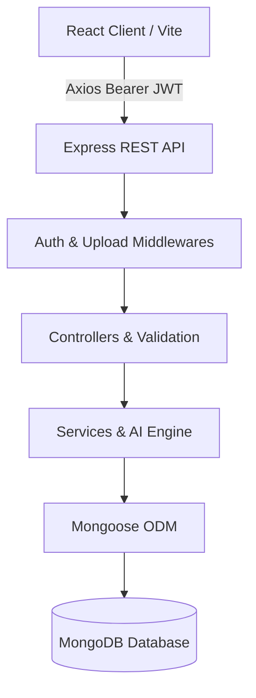

# 🚀 MERN Hackathon Universal Starter Kit (Day 0 Ready)

> **Speed is the #1 advantage in any hackathon.**  
> This starter kit eliminates 2–4 hours of repetitive setup (JWT authentication, role routing, CRUD boilerplate, UI kit, toast notifications, search/filter, and activity feeds) so your team can spend 100% of the hackathon solving the actual problem statement.

---

## ⚡ Quick Start (Run in 2 Steps)

### 1. Install Dependencies
```bash
npm run install:all
```

### 2. Run Server & Client Concurrently
```bash
npm run dev
```

- **Frontend (React + Vite):** [http://localhost:5173](http://localhost:5173)
- **Backend (Express API):** [http://localhost:5000](http://localhost:5000)
- **API Health Check:** [http://localhost:5000/api/health](http://localhost:5000/api/health)

---

## 🔑 Demo Accounts (Instant 1-Click Login)

For fast judging & live demos, 1-click login buttons are embedded directly into the navbar and auth screens:

| Role | Email | Password | Permissions |
| :--- | :--- | :--- | :--- |
| **👑 Admin (CTO)** | `admin@demo.com` | `Admin@123` | Full CRUD, User Management, Audit Logs, Settings |
| **👤 User (Member)** | `user@demo.com` | `User@123` | Dashboard, Project Tracking, Task Checklists, AI Tools |

To populate realistic seed data (users, projects, tasks, timeline events, and notifications):
```bash
npm run seed
```

---

## 🏗️ 4-Layer Hackathon Architecture



### Flow Breakdown:
1. **Frontend**: `Page` ➔ `Reusable UI Component` ➔ `Service Layer (Axios Interceptor)` ➔ `API Endpoint`
2. **Backend**: `Route` ➔ `Middleware (protect / authorize)` ➔ `Controller` ➔ `Service` ➔ `Model` ➔ `MongoDB`

---

## 📂 Project Directory Structure

```text
hackathon-project/
├── client/
│   ├── src/
│   │   ├── components/
│   │   │   ├── ui/          # Button, Input, Textarea, Select, Badge, Card, Modal, Loader, Skeleton, Tabs, Dropdown, Tooltip, Alert, StatsCard, ChartCard, ActivityTimeline
│   │   │   ├── common/      # SearchBar (Debounced), Pagination, DataTable, ConfirmDialog, FileUpload, Toast, NotificationDropdown
│   │   │   └── layout/      # Navbar, Sidebar, Footer, DashboardLayout, AuthLayout, PageHeader
│   │   ├── pages/           # Home (Landing), Login, Register, Dashboard, ProjectsPage, ItemDetail, FormTemplate, AiAssistant, UsersManagement, Profile, NotFound
│   │   ├── context/         # AuthContext, ToastContext, ThemeContext (Dark/Light Mode)
│   │   ├── hooks/           # useAuth, useToast, useTheme, useDebounce, useFetch
│   │   ├── services/        # api (Axios Interceptor), authService, userService, projectService, taskService, activityService, notificationService, aiService, uploadService
│   │   ├── utils/           # validators, formatDate, constants
│   │   ├── routes/          # AppRoutes (Public, ProtectedRoute, AdminRoute)
│   │   ├── App.jsx
│   │   ├── main.jsx
│   │   └── index.css        # CSS Custom Properties Design System & Animations
│   └── package.json
│
├── server/
│   ├── src/
│   │   ├── config/          # db.js (MongoDB Connection)
│   │   ├── controllers/     # authController, userController, projectController, taskController, activityController, notificationController, aiController, uploadController
│   │   ├── middlewares/     # authMiddleware (JWT protect & authorize), errorMiddleware, uploadMiddleware (Multer)
│   │   ├── models/          # User, Project, Task, Activity, Notification, AuditLog
│   │   ├── routes/          # authRoutes, userRoutes, projectRoutes, taskRoutes, activityRoutes, notificationRoutes, aiRoutes, uploadRoutes
│   │   ├── services/        # aiService (Summarize, Classify, Recommend, Chat), activityService
│   │   ├── utils/           # generateToken, apiResponse
│   │   ├── app.js           # Express app instance & route bindings
│   │   └── server.js        # Server listener
│   ├── seed.js              # Full realistic demo dataset generator
│   └── package.json
│
├── postman_collection.json  # Exported Postman / Thunder Client collection
├── package.json             # Root monorepo script runner
└── README.md
```

---

## 🎨 Reusable Screen Templates (Pre-Built)

1. **Template 1 — Landing Page (`/`):** Hero headline, feature grid, 1-click credentials showcase, architecture highlights, CTA footer.
2. **Template 2 — Executive Dashboard (`/dashboard`):** 4 KPI stats cards, multi-metric SVG bar charts, milestone progress bars, recent projects table, and real-time activity timeline feed.
3. **Template 3 — CRUD Showcase & Table (`/projects`):** Search bar with live debounce, status/priority filter dropdowns, table vs. grid view switcher, Add/Edit modal, and Delete confirmation dialog.
4. **Template 4 — Entity Detail View (`/projects/:id`):** Progress tracking bar, task checklist with toggleable checkboxes, metadata cards, and sprint comments.
5. **Template 5 — Comprehensive Form (`/template/form`):** Multi-section form with validations, dynamic keyword tags array, file uploader with drag-and-drop, and toast feedback.
6. **AI Intelligence Hub (`/ai-hub`):** NLP text summarizer, issue/ticket auto-categorizer, personalized recommendation engine, and interactive hackathon AI chatbot copilot.
7. **Admin User Management (`/users`):** Admin role-guarded user directory with search, role badges, and creation modal.

---

## 📡 Standardized API Format

All API responses follow a uniform JSON structure:

### Success Response:
```json
{
  "success": true,
  "message": "Project created successfully",
  "data": {
    "_id": "65e4f...",
    "title": "Smart AI Analytics",
    "status": "in-progress"
  },
  "meta": {
    "page": 1,
    "limit": 10,
    "total": 45
  }
}
```

### Error Response:
```json
{
  "success": false,
  "message": "Resource not found",
  "data": null
}
```

---

## 🔌 API Endpoints Summary

| Endpoint | Method | Access | Description |
| :--- | :---: | :---: | :--- |
| `/api/auth/register` | `POST` | Public | Register new user account |
| `/api/auth/login` | `POST` | Public | Sign in & receive JWT token |
| `/api/auth/me` | `GET` | Private | Get current user profile |
| `/api/auth/profile` | `PUT` | Private | Update name, title, bio, avatar |
| `/api/users` | `GET` | Admin | Search, filter, paginate team members |
| `/api/projects` | `GET` | Private | List projects with search & filters |
| `/api/projects` | `POST` | Private | Create a new project |
| `/api/projects/:id` | `GET` | Private | Get single project with tasks |
| `/api/projects/:id` | `PUT` | Private | Update project details |
| `/api/projects/:id` | `DELETE` | Private | Delete project and related tasks |
| `/api/tasks` | `POST` | Private | Create task and assign member |
| `/api/activities` | `GET` | Private | Fetch real-time system activity stream |
| `/api/notifications` | `GET` | Private | In-app user notifications |
| `/api/ai/summarize` | `POST` | Private | Summarize input document |
| `/api/ai/classify` | `POST` | Private | Categorize & prioritize ticket/issue |
| `/api/ai/chat` | `POST` | Private | AI assistant response generator |
| `/api/upload` | `POST` | Private | Multipart file upload (images, docs, pdf) |

---

## 💡 How to Adapt This Starter for Your Problem Statement in 5 Minutes

1. **Entities & Schemas**: Rename or add fields in `server/src/models/` (e.g., `Patient.js`, `Complaint.js`, `Donation.js`).
2. **API Controllers**: Copy `server/src/controllers/projectController.js` and rename endpoints to your problem statement.
3. **Frontend Views**: Copy `client/src/pages/ProjectsPage.jsx` and customize column names in `columns = []`.
4. **Theme Customization**: Update brand colors in `client/src/index.css` under `--primary` and `--secondary`.

---

## 🏆 Hackathon Presentation Tip
- Use the **1-Click Admin** button on the navbar during live judging to instantly show full system privileges without typing passwords.
- Highlight the **Activity Stream** and **Audit Logs** to demonstrate production-grade architecture.
- Showcase the **AI Copilot Hub** for high innovation scores!
